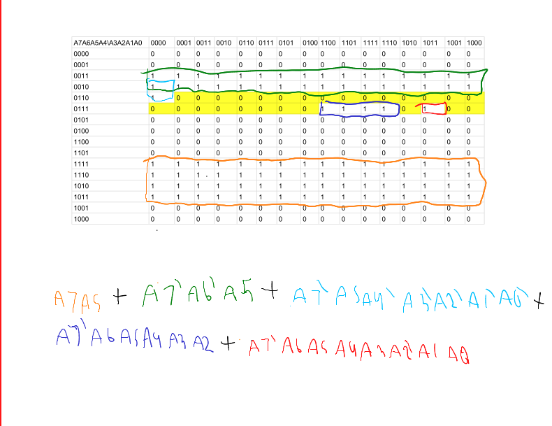
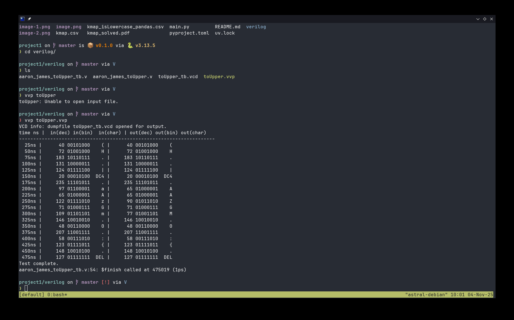

# Verilog toUpper

The project can be found [here.](https://github.com/AstralTurtle/211-p1) (https://github.com/AstralTurtle/211-p1)

## Kmap 
The kmap was filled in using a python/pandas script in main.py. This scirpt generates a csv file representation of the kmap where the lowercase letters are 1 while everything else is zero,

 This was then imported into google sheets, where I highlighted the letters that would be changed by the function, and then mapped the kmap to be A5 out. I then imported an image of that into a pdf editing file and grouped my kmap as seen below.

The yellow background squares are the lowercase letters, which have their value forcibly set to one. Then I grouped my ones to get a Sum of Product equation:

**F=A6′A5+A7A5+A7′A6A5A4′A3′A2′A1′A0′+A7′A6A5A4A3A2+A7′A6A5A4A3A2′A1A0**

## Testbench vvp

Here is the testbench vvp being executed after compiling. It shows that at any time higher then 25 ns, the circuit has correct output. The circuit is tested using 25.001 delay.

## First waveform: '('

Here is the first test in waveform form, taking in '(' as an input. This returns '(' after 25 ns.

## a -> A

Here is a later waveform, that takes in 'a' and returns 'A' after 25 ns.

## full test bench

and here is the full testbench in wavefrom form, running all 19 tests with each taking 25 ns (with an extra .001 ns of delay.)