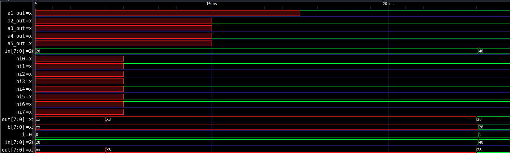
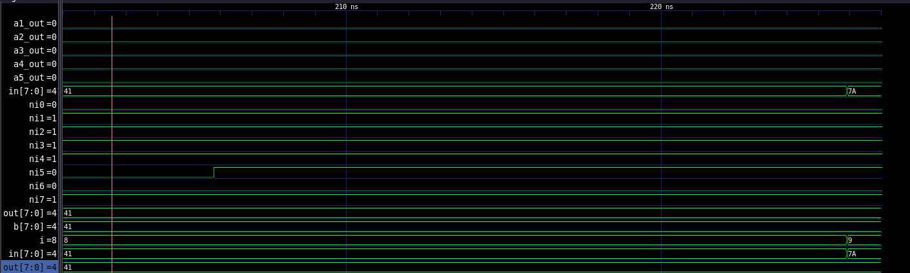

# Verilog toUpper

## Kmap 
The kmap was filled in using a python/pandas script in main.py. This scirpt generates a csv file representation of the kmap where the lowercase letters are seperated. This was then imported into google sheets, where I highlighted the letters that would be changed by the function, and then mapped the kmap to be A5 out. I then imported an image of that into a pdf editing file and grouped my kmap as seen below.

[text](kmap_solved.pdf)

F=A6′A5+A7A5+A7′A6A5A4′A3′A2′A1′A0′+A7′A6A5A4A3A2+A7′A6A5A4A3A2′A1A0

propogating at 25.1 ns.
## First waveform: '('

## a -> A

## full test bench
